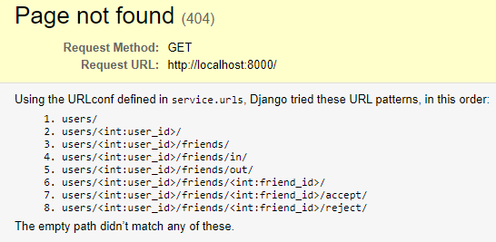
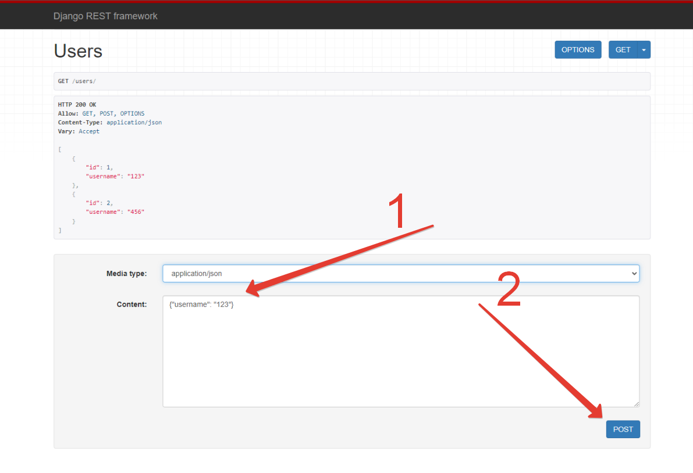

# Задание

Необходимо спроектировать и разработать Django-сервис друзей.

Сервис должен предоставлять возможности:
- зарегистрировать нового пользователя
- отправить одному пользователю заявку в друзья другому
- принять/отклонить пользователю заявку в друзья от другого пользователя
- посмотреть пользователю список своих исходящих и входящих заявок в друзья
- посмотреть пользователю список своих друзей
- получить пользователю статус дружбы с каким-то другим пользователем (нет ничего / есть исходящая заявка / есть входящая заявка / уже друзья)
- удалить пользователю другого пользователя из своих друзей
- если пользователь1 отправляет заявку в друзья пользователю2, а пользователь2 отправляет заявку пользователю1, то они автоматом становятся друзьями, их заявки автоматом принимаются

Модель пользователя может быть самой простой:
- id
- username

Необходимо:
- описать REST интерфейс сервиса с помощью OpenAPI
- написать на Django сервис по этой спецификации
- описать краткую документацию с примерами запуска сервиса и вызова его API
+ unit-тесты будут плюсом
+ Docker для упаковки в контейнер будет плюсом

Выходные артефакты:
- Исходный код
- OpenAPI спецификация
- документация с описанием запуска и примерами использования API

________________
# Документация

- ## [Исходный код](service)
- ## [OpenAPI спецификация](openapi3_0.yaml)

## Описание запуска

Проверьте, что не занят порт 8000 на локальной машине.

Запуск через докер:
```
docker-compose up
``` 
Запуск напрямую через Python:
```
cd service
python manage.py makemigrations service
python manage.py migrate service
python manage.py runserver
```
Запуск тестов:
```
cd service
python manage.py test --verbosity 2
```

## Пример использования API

Если сервис уже запущен, то зайдите по ссылке http://127.0.0.1:8000/

Интерфейс использования интуитивно понятен.

Будет предложен список путей, которыми можно будет воспользоваться. 



Например, на картинке первым элементом стоит `users/`, тогда этот путь нужно добавить к исходной ссылке http://127.0.0.1:8000/ и получить: 
- http://127.0.0.1:8000/users/

Единственное место, где нужно что-то писать - http://127.0.0.1:8000/users/:
- В поле для ввода достаточно написать json с полем `"username"`
  - Вводим: `{"username": "123"}`
  - нажимаем на кнопку `POST`
  - Создали нового пользователя
  - PROFIT

  

- Если видим поля, наподобие `<int:user_id>`, то их нужно заменить на число, которое можно увидеть в поле `id` у каждого пользователя.
  - В случае `http://127.0.0.1:8000/users/<int:user_id>` и при `id = 1` получаем `http://127.0.0.1:8000/users/1`

## Таблица запросов API

| HTTP request                                         | Description                                                                |
|------------------------------------------------------|----------------------------------------------------------------------------|
| **GET** /users                                       | Получить список всех пользователей                                         |
| **POST** /users                                      | Зарегистрировать нового пользователя                                       |
| **POST** /users/{user_id}/friends/{friend_id}/accept | Принять заявку в друзья                                                    |
| **DELETE** /users/{user_id}/friends/{friend_id}      | Удалить пользователя из друзей и/или удалить заявку в друзья               |
| **GET** /users/{user_id}/friends/{friend_id}         | Получить статус дружбы пользователя с каким-то другим пользователем        |
| **POST** /users/{user_id}/friends/{friend_id}        | Послать заявку в друзья                                                    |
| **POST** /users/{user_id}/friends/{friend_id}/reject | Отклонить заявку в друзья                                                  |
| **GET** /users/{user_id}/friends                     | Получить список друзей пользователя                                        |
| **GET** /users/{user_id}/friends/in                  | Получить список приглашений для этого пользователя от других пользователей |
| **GET** /users/{user_id}/friends/out                 | Получить список приглашений от этого пользователя другим пользователям     |
| **GET** /users/{user_id}                             | Получить пользователя по ID                                                |

